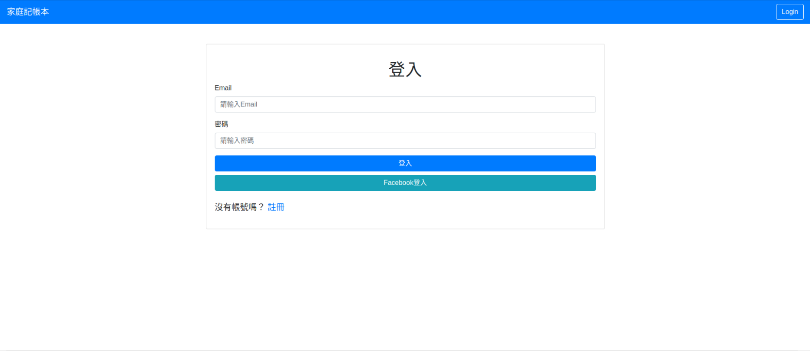
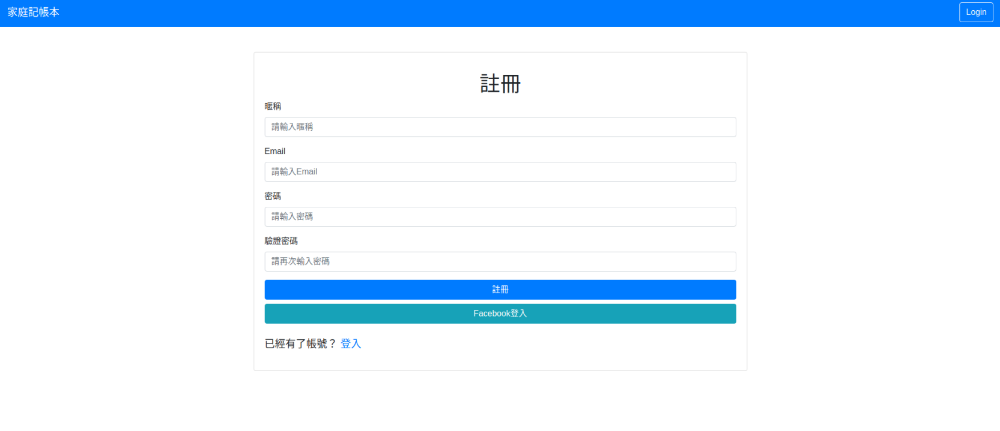
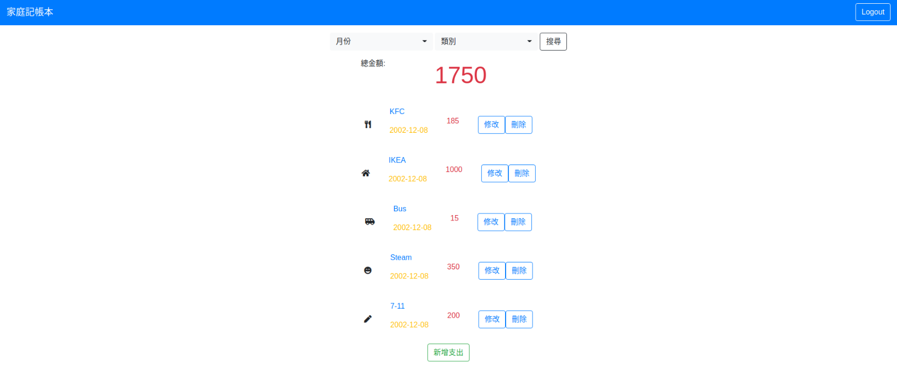

# 家庭記帳本(expense-tracker)

## 簡介
家庭記帳本提供不同家庭成員有各自專屬的記帳本，可以透過各自的帳號來管理自己的記帳紀錄。
在帳號方面，使用者可以：
1. 可以註冊帳號
2. 依據註冊的帳號，進行登入
3. 可以使用Facebook帳號進行登入

在記帳方面，使用者可以：
1. 在首頁一次瀏覽所有支出的清單
2. 在首頁看到所有支出清單的總金額
3. 新增一筆支出
4. 編輯支出的所有屬性 (一次只能編輯一筆)
5. 刪除任何一筆支出 (一次只能刪除一筆)
6. 在首頁可以根據支出「**類別**」跟「**月份**」篩選支出；總金額的計算只會包括被篩選出來的支出總和。
## 下載repo
（兩種下載法二擇一）
1. 使用cmd下載
   ```bash
   git clone -b main --single-branch git@github.com:jadokao/expense-tracker.git
   ```
2. 直接下載：
   1. 點選綠色框框的『Code』
   2. 點選『Download ZIP』
## 安裝方法
1. 打開cmd，將路徑切至資料夾
2. 安裝套件：
    ```bash
    npm install
    ```
3. 安裝種子檔：
    ```bash
    npm run seed
    ```
    註：種子檔所建立的帳號密碼為
    I. 帳號：root@example.com
    II. 密碼：1234567
4. 依據 .env.example 檔的內容，替換環境變數
5. 執行：
    ```bash
    npm run dev
    ```
6. 離開：使用```ctrl + c```或```cmd + c```
## 畫面範例



## 相關套件與版本
##### 檔案管理相關
* npm：7.7.6
* express: 4.17.1
* express handlebars: 5.3.2
* nodemon: 2.0.9
* body-parser: 1.19.0
* mongoose: 5.13.2
* method-override: 3.0.0
* bcryptjs: 2.4.3
* connect-flash: 0.1.1
* dotenv: 10.0.0
* express-session: 1.17.2
* passport: 0.4.1
* passport-facebook: 3.0.0
* passport-local: 1.0.0
##### 視覺效果相關
* jquery: 3.6.0
* popper: v2.9.1
* bootstrap: v4.6.0
* font-awesome: v5.15.3